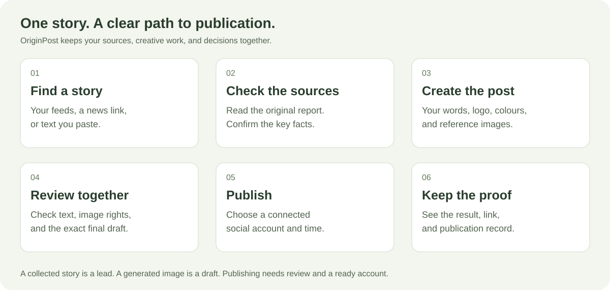
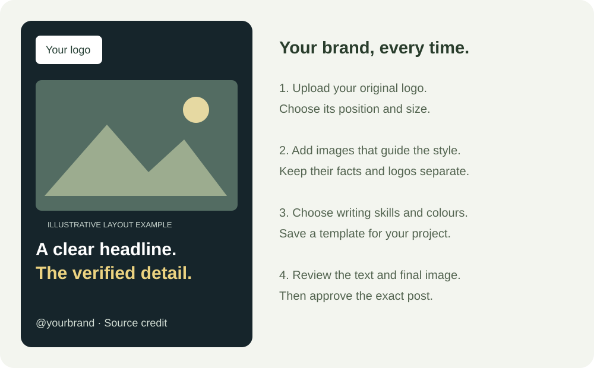
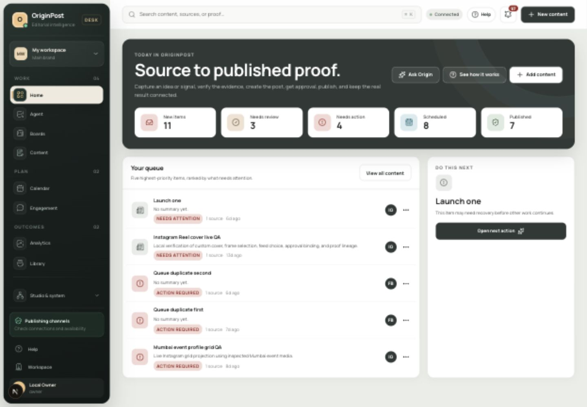

# OriginPost

**Turn a news story into a reviewed social post—with the sources kept alongside it.**

OriginPost is a shared workspace for publishers, creators, and social-media teams. Collect news, check it, write a caption, create a branded image, and review the post before publishing.



## How you use it

1. **Bring a story.** Paste a news link or text in Agent, or collect updates from your chosen news feeds.
2. **Check what is true.** Open the original sources. Confirm names, dates, numbers, and important claims. A feed headline is a lead, not a verified fact.
3. **Make it yours.** Choose your project's template, original logo, writing style, colours, and example images.
4. **Review the result.** Read the caption and text inside the image. Check image rights, authenticity, and any AI disclosure. Ask for changes in the same project chat.
5. **Publish and keep the receipt.** Use a connected Instagram, Facebook Page, or YouTube account. The final draft must pass review and the platform's checks. YouTube requires a video.

For a finished agent image post, open **@Publisher** in the chat. Review and approve the exact draft, choose a live account, check the time and required AI label, then confirm the publishing preview. Its publishing record stays in the chat. The generated package currently starts with an Instagram draft; Facebook adaptations and YouTube videos use the full content editor.

## Your daily news desk

Create sections such as **Gujarat, India, World, Business, or Science**, then add publisher-provided RSS/Atom feeds or public newsroom pages. Choose checks every 10 minutes, 30 minutes, 2 hours, or daily.

- **Newest published:** sort by the publication time reported by the source.
- **Newly found:** see what OriginPost discovered most recently.
- **Recent news:** filter to the last 2 hours, 24 hours, or 7 days.
- **Your sections:** filter by a saved source collection and search headlines or publishers.

Choose **Create post** on a news lead to open it in Agent. Its original links stay attached: pick your template, add your direction, then start research and creation. A changed lead asks you to reopen the current version.

You can keep NASA, PIB government, RBI banking and SEBI regulation feeds in separate collections. Each section shows its last check and any collection failures.

Unknown dates stay visibly unknown. Repeated checks do not make an old story look newly published. Website sources include a private desktop screenshot: open **View desktop capture** to compare the page with the extracted news. Login-protected, blocked, or script-only pages need a manual check.

The collector reads your configured sources; it cannot promise every story from every website. Source failures and monitor history are available in Automations.

**Sourcing matters twice:** verify the report before writing, then compare the final text and image against that evidence before release. A second publisher repeating the same wire report is not independent corroboration. A publicly visible image is not automatically available to reuse.

[How sourcing works](docs/source-signal-desk.md) · [Checked source catalog and critical verification rules](docs/research/2026-09-15-news-source-catalog.md)

Before creating an image, a second AI pass checks the written post against its saved sources. If it finds a problem, creation stops and shows the reasons. After composition, a configured vision model reads the image text and checks the logo, clarity and illustration label. Differences stop the run and remain visible in chat. An editor still inspects the image and approves publication.

## Set up your brand once



Templates keep logo placement, image references, writing skills, colours, and footer text together. The original logo is placed after image generation. Example captions and similar-post images guide style; they do not supply verified facts.

Each new version stays in the project chat, so you can compare the changes. Boards organize projects and team tasks.



Desktop capture of the local owner account. The displayed queue contains local testing records.

[Agent and template guide](docs/agent-chat-ui.md) · [Boards and team work](docs/boards.md)

## Can I use images made in Codex?

**Yes, Codex supports interactive image creation and image references.** OriginPost also has a server image-generation connection. They are separate execution paths.

In Agent, choose **Generate in Codex & upload**. After research and writing, download the brief and open its style references. Give these to Codex, then upload the generated PNG or JPEG to the same project chat. OriginPost applies your original logo and exact headline, adds an AI label, and prepares the draft for review.

The uploaded image is recorded as editor-attested AI imagery, not a verified provider receipt. Tagging Codex alone does not yet publish a post. The final post still needs a connected account and review.

[Verified Codex capabilities and integration plan](docs/research/2026-09-15-codex-image-workflow.md)

## What needs connecting?

| To do this | Set up this |
| --- | --- |
| Collect news automatically | Your feed URLs and the background worker |
| Research and write with an agent | A tested text/research runtime |
| Generate new images | The server image provider, or a Codex-created file |
| Publish to social media | The relevant social account and publishing permissions |
| Work with a team | Team sign-in and workspace invitations |

This is an **alpha**. Local test connections are simulations and are labeled as such. A successful code build does not mean live accounts or providers are connected.

## Run it locally

For the person setting up the software: install Node.js 22+, pnpm 10+, and Docker, then run:

```bash
cp .env.example .env
docker compose up -d postgres redis minio
pnpm install
pnpm db:migrate
pnpm dev
```

Open [localhost:3000](http://localhost:3000). Keep `.env` private. Default local mode is for a trusted machine; use the deployment guide before making the service public.

[Full setup and feature reference](docs/technical-overview.md) · [Connect social accounts](docs/channels.md) · [Deployment and release](docs/public-release.md) · [Architecture](docs/architecture.md)

## License

OriginPost is open source under [AGPL-3.0-only](LICENSE).

For a single-owner local setup, [connect Codex](docs/local-codex-bridge.md) to write and check images using your ChatGPT sign-in. Optional live news research uses the same local connection: it opens public web sources, then OriginPost fetches the pages separately to check the quoted excerpts. Each source shows matched, mismatched or unavailable evidence. Image generation remains a separate connection.
