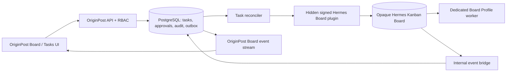

# Board-scoped Tasks/Kanban for OriginPost

**Date:** 2026-09-12  
**Status:** Implementation recommendation  
**Hermes source pin:** `NousResearch/hermes-agent` tag `v2026.9.7` (`v0.21.1`), commit `2237be355906fbe6065ce1815711eee52b2d646e`  
**Scope:** Research only; no product code was changed.

## Executive decision

OriginPost should add **Tasks as a feature inside each top-level Board**. Hermes should remain an internal, replaceable execution plugin. The browser must talk only to OriginPost APIs; it must never receive a Hermes profile name, Board slug, filesystem path, dashboard token, or direct Hermes REST/WebSocket endpoint.

The first release should use a deliberately narrower workflow than native Hermes:

`draft -> queued -> running -> needs_input | review -> done -> archived`

with an explicit human **Release** action between authoring and execution. `failed` is also a visible terminal/retry state. OriginPost should keep the product/audit record in PostgreSQL and project released work into one opaque Hermes Kanban Board per OriginPost Board through the existing signed, internal plugin boundary.

The most important implementation finding is that **a Hermes Profile does not isolate its Kanban data**. Hermes intentionally places Kanban under a shared default root across profiles; hard Board selection is a separate concern. OriginPost therefore needs both:

1. the existing dedicated Hermes Profile per OriginPost Board for memory, skills, config, and credentials; and
2. a dedicated, opaque Hermes Kanban Board slug pinned on every command, worker, and event subscription.

This preserves the product hierarchy the user requested:

```text
OriginPost
└── Board (top-level product object)
    ├── Work
    ├── Tasks
    ├── Memory
    └── Skills
        └── Hermes integration (internal implementation only)
```

## Evidence labels and method

This report uses four labels throughout:

- **Verified fact** — confirmed in the official tagged Hermes source, official documentation, or release notes.
- **Reported demand/risk** — an official GitHub issue exists, but its problem statement is a reporter's claim unless separately confirmed in tagged source.
- **Inference** — a consequence derived from verified behavior and OriginPost's current architecture.
- **Proposal** — behavior OriginPost should implement; it is not a claim about Hermes today.

The supplied [Reddit post](https://www.reddit.com/r/AISEOInsider/comments/1w613ei/hermes_agent_latest_version_0210_is_actually/) is used only as secondary product-demand context. Its themes—specialized roles, handoffs, continuity, centralized management, and human judgment—are useful, but every implementation claim below is grounded in the official repository, tagged documentation, release notes, or official GitHub issues.

## What Hermes actually provides

### Version and product context

**Verified fact.** The selected upstream point is Hermes Agent `v2026.9.7`, described as `v0.21.1`, released on 2026-09-07. The official notes call it a broad patch rollup since `v0.21.0` and explicitly say the notes are not exhaustive. Pin implementation and conformance tests to the immutable tag/commit, not to `main`. [Release `v2026.9.7`](https://github.com/NousResearch/hermes-agent/releases/tag/v2026.9.7)

**Verified fact.** The preceding `v0.21.0` release added bot mode and roles, peer direct messages, persistent cron continuity, steerable subagents, the command center, and security hardening. These explain the Reddit post's multi-agent framing, but do not by themselves define a safe multi-tenant product boundary. [Release `v2026.8.31`](https://github.com/NousResearch/hermes-agent/releases/tag/v2026.8.31)

### Boards, tenants, and Profiles are different boundaries

**Verified fact.** Hermes describes a Kanban Board as a standalone queue for a project, repository, or domain. Named Boards have separate SQLite databases, workspaces, and logs. Workers receive `HERMES_KANBAN_BOARD`; cross-Board dependency links are not supported. The documentation characterizes tenant as a soft filter inside a Board, while a Board is the hard queue boundary. [Official Kanban guide](https://github.com/NousResearch/hermes-agent/blob/v2026.9.7/website/docs/user-guide/features/kanban.md)

**Verified fact.** Hermes Profiles separately own configuration, `.env`, SOUL, memory, sessions, skills, cron, and state. Profiles are not OS sandboxes. Host subprocesses retain the real home directory unless `terminal.home_mode: profile` is configured, and the official guide cautions against concurrent processes sharing one Profile because memory writes can contaminate one another. [Official Profiles guide](https://github.com/NousResearch/hermes-agent/blob/v2026.9.7/website/docs/user-guide/profiles.md)

**Verified fact.** `kanban_home()` deliberately defaults to the global Hermes root rather than the active Profile home. Its source comment says Kanban is shared across profiles “by design.” `HERMES_KANBAN_HOME` can override the root, while dispatch pins the selected Board/database/workspace through environment variables. [Tagged `kanban_db.py`](https://github.com/NousResearch/hermes-agent/blob/v2026.9.7/hermes_cli/kanban_db.py#L382-L505)

**Inference.** OriginPost's existing one-Profile-per-Board design correctly separates memory and skills, but it is insufficient to separate native Kanban tasks. Any use of ambient “current Board” or default database selection risks cross-Board execution.

**Proposal.** Store an opaque `hermes_board_ref` beside the already opaque Profile binding. Server code must select both values from the authenticated OriginPost `boardId`; clients and user-entered payloads must never choose either value.

### Native task record and related tables

**Verified fact.** The tagged `Task` record contains these fields: `id`, `title`, `body`, `assignee`, `status`, `priority`, `created_by`, `created_at`, `started_at`, `completed_at`, `workspace_kind`, `workspace_path`, `claim_lock`, `claim_expires`, `tenant`, `branch_name`, `project_id`, `result`, `idempotency_key`, `consecutive_failures`, `worker_pid`, `last_failure_error`, `max_runtime_seconds`, `last_heartbeat_at`, `current_run_id`, `workflow_template_id`, `current_step_key`, `skills`, `model_override`, `provider_override`, `reasoning_effort`, `max_retries`, `goal_mode`, `goal_max_turns`, `session_id`, `block_kind`, `block_recurrences`, and `completion_contract`. `skills` is only a list of skill names; it does not capture source or content digest. [Tagged task data class and schema](https://github.com/NousResearch/hermes-agent/blob/v2026.9.7/hermes_cli/kanban_db.py#L670-L1046)

**Verified fact.** The SQLite schema includes:

- `tasks` — current task state and latest execution pointers;
- `task_links` — directed parent/child dependency edges;
- `task_comments` — author/body/timestamp;
- `task_events` — monotonic integer event ID, task ID, optional run ID, kind, JSON payload, timestamp;
- `task_runs` — one row per attempt, with profile, claim, PID, heartbeat, runtime limit, outcome, summary, metadata, and error;
- `task_attachments` — file metadata plus an absolute on-disk stored path; and
- `kanban_notify_subs` — channel/thread delivery cursors for completed/blocked notifications.

[Tagged task schema](https://github.com/NousResearch/hermes-agent/blob/v2026.9.7/hermes_cli/kanban_db.py#L670-L1046)

**Proposal.** OriginPost should not expose the native row shape. In particular, `workspace_path`, claim tokens, process IDs, Profile names, session IDs, absolute attachment paths, provider configuration, and raw run errors are internal. The product model should use OriginPost IDs and sanitized projections.

### Exact lifecycle and transition semantics

**Verified fact.** Hermes' current status set is:

`triage`, `todo`, `scheduled`, `ready`, `running`, `blocked`, `review`, `done`, `archived`.

The accepted create-time `initial_status` inputs are `running` and `blocked`, but the graph initializer turns the ordinary `running` input into dependency-aware `ready`/`todo`; this is not a direct create-in-running bypass. Valid workspace kinds are `scratch`, `worktree`, and `dir`. Typed block kinds are `dependency`, `needs_input`, `capability`, and `transient`. [Tagged constants and task kernel](https://github.com/NousResearch/hermes-agent/blob/v2026.9.7/hermes_cli/kanban_db.py#L80-L103)

Task status and run status are separate. A task can accumulate multiple `task_runs`; a claim opens a run and completion, block, crash, timeout, or reclaim closes it. The run table records statuses such as `running`, `done`, `blocked`, `crashed`, `timed_out`, `failed`, and `released`, while outcomes include completion/block/crash/timeout/spawn-failure/give-up/reclaim and review handoff outcomes used by the lifecycle code. [Tagged task/run schema](https://github.com/NousResearch/hermes-agent/blob/v2026.9.7/hermes_cli/kanban_db.py#L670-L1046)

The canonical transitions are:

| Operation | Native transition | Verified behavior |
|---|---|---|
| Create | new -> `triage`, `blocked`, `todo`, or `ready` | `triage=True` wins; an explicit blocked initial state parks work; otherwise unfinished parents produce `todo`, and satisfied/no parents produce `ready`. Title is required. The pre-write idempotency lookup can still race because no unique database constraint closes concurrent duplicate creation. |
| Promote dependencies | `todo` or eligible non-sticky `blocked` -> `ready`/`review` | All parents must be `done` or `archived`. Explicit sticky blocks and failure-limit blocks do not auto-promote. |
| Claim | `ready` -> `running` | Atomic compare-and-set, dependency recheck, claim token/TTL, and a new run row. |
| Claim review | `review` -> `running` | A new run tracks review separately; parents are rechecked. |
| Complete | `running`, `ready`, `blocked`, or `review` -> `done` | Parents are rechecked, result/summary/metadata are stored, attachments may be preserved, block recurrence resets, and eligible children are promoted. |
| Block | `running`/`ready` -> `blocked`, `todo`, or `triage` | A dependency block routes to `todo`; other blocks route to `blocked`; repeated same-kind blocking eventually routes to `triage`. An expected run ID can guard the mutation. |
| Request review | `running`/`ready` -> `review` | Implementer/reviewer are recorded. Clearing a live claim requires the expected run ID or `force=True`. |
| Request changes | reviewer's `running` -> `ready` or `todo` | The task routes back to the recorded implementer, with parent gating reapplied. |
| Unblock/reopen | `blocked`/`scheduled`/`review` -> `ready`, `review`, or `todo` | Destination depends on prior source state and current parent completion. |
| Archive | active/terminal -> `archived` | Soft terminal state; hard deletion also exists separately. |
| Schedule | eligible task -> `scheduled` | Later release returns it to a dispatchable/dependency-gated state. |

The create semantics are implemented in the tagged database kernel, including the documented concurrent idempotency race. [Create implementation](https://github.com/NousResearch/hermes-agent/blob/v2026.9.7/hermes_cli/kanban_db.py#L1221-L1381) Claim and dependency promotion use transactional compare-and-set logic. [Promotion and claim implementation](https://github.com/NousResearch/hermes-agent/blob/v2026.9.7/hermes_cli/kanban_db.py#L2002-L2205) Completion, blocking, review, changes-requested, unblocking, reopening, scheduling, and archive operations are centralized in the same kernel. [Lifecycle implementation](https://github.com/NousResearch/hermes-agent/blob/v2026.9.7/hermes_cli/kanban_db.py#L2524-L3165) [Archive/delete implementation](https://github.com/NousResearch/hermes-agent/blob/v2026.9.7/hermes_cli/kanban_db.py#L3251-L3558)

**Inference.** Native `complete_task` accepting `blocked -> done` is useful for an operator, but it is too permissive to represent OriginPost approval. A worker or generic adapter must not translate “block resolved” into “human approved.”

**Proposal.** Keep approval as an OriginPost-owned decision record and guarded endpoint. Do not infer it from a Hermes status change. A human-required task can reach OriginPost `done` only after the required review record is signed by an authorized, distinct actor.

### Model-facing task tools

**Verified fact.** The tagged `kanban` toolset registers these model-facing tools:

- `kanban_show`, `kanban_list`;
- `kanban_complete`, `kanban_block`, `kanban_request_review`, `kanban_request_changes`, `kanban_heartbeat`;
- `kanban_comment`;
- `kanban_attach`, `kanban_attach_url`, `kanban_attachments`;
- `kanban_create`, `kanban_unblock`, `kanban_link`.

`kanban_list` and `kanban_unblock` are marked orchestrator-only. Worker guards restrict lifecycle mutations to the task identified by the worker environment; creation/comments/links are the intended handoff mechanisms for related work. [Tagged tool registration](https://github.com/NousResearch/hermes-agent/blob/v2026.9.7/tools/kanban_tools.py#L950-L979) [Tagged tool schemas](https://github.com/NousResearch/hermes-agent/blob/v2026.9.7/tools/kanban_tools_schemas.py)

**Proposal.** Do not simply add the broad native `kanban` toolset to OriginPost's generic Board run. Extend the hidden Board plugin with a dedicated worker-only task schema, exact handler hashes, server-pinned task/Board/Profile context, and per-command policy checks.

### Dashboard HTTP surface

**Verified fact.** Under the Kanban dashboard plugin mount, the tagged API exposes:

- Board/task CRUD: `GET /board`, `GET /tasks/{id}`, `POST /tasks`, `PATCH /tasks/{id}`, `DELETE /tasks/{id}`, `POST /tasks/bulk`;
- task material: list/upload/download/delete attachments, create comments, create/delete dependency links;
- operations: diagnostics, active workers, run detail/inspection/termination, reclaim, specify, reassign, estimate, log, and dispatch;
- configuration: config, home-channel subscriptions, stats, assignees, model options, and projects;
- Board/Profile administration: list/create/update/delete/export/import/switch Boards, list/update/describe Profiles;
- planning: decompose and orchestration read/update; and
- live updates: WebSocket `/events`.

The route decorators and request models are in the official tagged plugin. Its task creation payload includes title, body, assignee, tenant, priority, workspace, parents, triage, idempotency, runtime, skills, goal settings, model/provider/reasoning, and project. Directly setting `running` is rejected; dispatch must claim the task. [Tagged dashboard plugin API](https://github.com/NousResearch/hermes-agent/blob/v2026.9.7/plugins/kanban/dashboard/plugin_api.py#L266-L1604)

**Proposal.** None of those endpoints should be proxied one-for-one to the OriginPost browser. They mix safe product actions with infrastructure operations such as process termination, Board switching, Profile edits, filesystem-backed attachments, raw logs, model/provider selection, and dispatch.

### WebSocket and update behavior

**Verified fact.** The native WebSocket `/events` binds a Board from `?board=` at handshake and resumes from `?since=`. It opens a per-socket SQLite connection, polls every 0.3 seconds, fetches at most 200 events ordered by monotonic ID, and emits `{events, cursor}`. The dashboard client debounces bursts and refetches Board data instead of treating event payloads as complete state. [Tagged WebSocket implementation](https://github.com/NousResearch/hermes-agent/blob/v2026.9.7/plugins/kanban/dashboard/plugin_api.py#L1605-L1707) [Official Kanban guide](https://github.com/NousResearch/hermes-agent/blob/v2026.9.7/website/docs/user-guide/features/kanban.md)

**Verified fact.** The main web server's tagged source gates `/api/` requests except an explicit public allowlist and applies the plugin runtime gate; WebSockets use the dashboard's token/ticket/session checks. A paragraph in the Kanban guide still says `/api/plugins` is skipped/unauthenticated, which conflicts with the newer tagged server middleware. The code is the implementation authority. [Tagged HTTP middleware](https://github.com/NousResearch/hermes-agent/blob/v2026.9.7/hermes_cli/web_server.py#L373-L423) [Tagged plugin runtime gate](https://github.com/NousResearch/hermes-agent/blob/v2026.9.7/hermes_cli/web_server.py#L577-L644)

**Inference.** Even with the current process-wide Hermes session gate, native auth does not provide OriginPost organization membership, workspace role, or Board-object authorization. Direct exposure remains unsafe.

## Fit with the current OriginPost architecture

### Existing strengths

OriginPost already has the right outer product boundary:

- `Board` is a top-level domain object, not a Hermes concept exposed to users.
- Each Board receives a dedicated opaque Hermes Profile for memory, skills, configuration, and credentials.
- Hermes is represented as the hidden internal module `org.originpost.hermes-boards`.
- The runtime boundary uses server-derived identity, signed requests, tokens, nonces, epochs, exact approved skill/tool manifests, attestation, and a durable reconciliation outbox.
- The product API does not return raw Hermes Profile IDs, memory paths, or skill paths.
- Board roles already separate viewing (`content:read`), content execution (`content:create`), and owner/workspace administration (`workspace:manage`).

See the local architecture baseline in [`docs/boards.md`](../boards.md), the Board aggregate in `packages/domain/src/agent-board.ts`, the current controller/service in `apps/api/src/boards/`, and the runtime boundary in `packages/agents/src/hermes-board-plugin.ts`.

### Current gaps

The next slice needs new domain and adapter capabilities; it is not only a Kanban view:

1. There is no Board-task aggregate, task repository, run-attempt projection, approval record, comment/dependency model, or durable task command outbox.
2. The current Board routes cover Board/plugin approval, reconcile, test/run, and run history, but no task routes.
3. `BoardRuntimePort` currently covers inspect, reconcile, deactivate, pending-write review, and a generic run. It has no narrow task lifecycle/event seam.
4. The allowed Hermes handlers are memory/skill handlers, not a task-worker lifecycle contract.
5. Existing Profile isolation must be paired with explicit Kanban Board selection.
6. There is no OriginPost-owned live task event projection or resumable Board-scoped event cursor.

## Proposed OriginPost design

### System boundary



**Proposal.** PostgreSQL is the authoritative product control plane and audit log. Hermes Kanban is the internal execution projection and durable worker substrate. Every outbound command has a durable OriginPost outbox/saga record; every acknowledged Hermes mutation stores a sanitized remote receipt. Every inbound Hermes event is deduplicated and normalized before the product UI can see it.

An acceptable fallback is to treat Hermes SQLite as authoritative for detailed execution state while still keeping PostgreSQL commands, audit, reconciliation, and a read projection. A direct UI-to-Hermes path is not acceptable in either design.

### Product domain additions

Add Board-owned records such as:

| Record | Required product fields |
|---|---|
| `BoardTask` | OriginPost ID, `boardId`, title/spec, product status, priority, assignee reference, approval policy, dependency/version counters, release snapshot, created/updated actor and timestamps |
| `BoardTaskLink` | same-Board parent/child IDs, relationship type, creator/time; database constraint forbids cross-Board edges |
| `BoardTaskComment` | task/Board ID, authenticated actor, body, visibility, timestamp; agent comments must be labeled as agent-authored |
| `BoardTaskRun` | attempt, sanitized status/outcome, profile binding version, tool/skill manifest digests, started/ended/heartbeat, usage/cost, proof/artifact summary, remote run reference |
| `BoardTaskDecision` | release/approve/reject/cancel/retry action, authenticated actor, reason, task version, timestamp, policy result |
| `BoardTaskEvent` | monotonic OriginPost cursor, Board/task/run IDs, normalized kind, actor/surface, payload, source event ID, timestamp |
| `BoardTaskCommand` | idempotency key, expected task version, desired mutation, target binding epochs, state/attempts/error/receipt |

Do not persist a Hermes Profile name or Board slug in browser-visible DTOs. Encrypt or deterministically derive the internal binding, as the existing Board plugin already does for Profile identity.

### Public Board task API

Use Board-nested routes only. A concrete initial contract is:

```text
GET    /boards/:boardId/tasks
POST   /boards/:boardId/tasks                 # creates draft only
GET    /boards/:boardId/tasks/:taskId
PATCH  /boards/:boardId/tasks/:taskId          # If-Match version required
POST   /boards/:boardId/tasks/:taskId/release
POST   /boards/:boardId/tasks/:taskId/cancel
POST   /boards/:boardId/tasks/:taskId/retry
POST   /boards/:boardId/tasks/:taskId/request-review
POST   /boards/:boardId/tasks/:taskId/approve
POST   /boards/:boardId/tasks/:taskId/request-changes
POST   /boards/:boardId/tasks/:taskId/comments
POST   /boards/:boardId/tasks/:taskId/dependencies
DELETE /boards/:boardId/tasks/:taskId/dependencies/:parentId
GET    /boards/:boardId/tasks/:taskId/runs
GET    /boards/:boardId/task-events?after=:cursor
GET    /boards/:boardId/task-events/stream?after=:cursor
```

Every mutation needs an idempotency key and expected version. The server must derive organization, Board, Profile, Hermes Board, tool manifest, skill manifest, and actor. It must reject foreign task IDs even if the caller can guess a native reference.

### Product state machine and native mapping

| OriginPost state | Meaning | Hermes projection |
|---|---|---|
| `draft` | Human-editable plan; never executable | No native task yet, or a deliberately non-dispatchable internal record; preferred: no projection until release |
| `queued` | Authorized for execution, waiting on dependencies/capacity | `todo`, `ready`, or `scheduled` |
| `running` | An attested worker owns the current attempt | `running` with matching run ID/claim |
| `needs_input` | External input, permission, or human decision is required | `blocked`; dependency-only wait remains `queued` |
| `review` | Work returned with evidence for a reviewer | `review` |
| `done` | Completion contract and any required human approval passed | `done` |
| `failed` | Retry budget exhausted, policy/attestation failure, or unrecoverable execution error | native block/failure outcome normalized to explicit product failure |
| `archived` | Hidden from active flow, retained for audit | `archived` |

`triage` should not be a user-visible execution state in the first release. The optional **Plan with Hermes** action can ask an internal planner to propose tasks and dependencies, but those proposals land as `draft` rows and require human acceptance/release. Disable automatic decomposition, automatic subscription/wake, and ambient Board switching initially.

### Permissions and approval policy

Use existing permissions as a starting point, but add action-level checks:

| Action | Minimum recommended permission | Additional guard |
|---|---|---|
| View tasks/runs/proof | `content:read` | sanitize internal paths, tokens, model/provider details, and sensitive logs |
| Create/edit/comment on draft | `content:create` | same organization and Board; version check |
| Release/retry ordinary task | `content:create` plus Board policy | explicit decision record; only approved tools/skills |
| Approve/reject human-required task | `workspace:manage` or dedicated `task:approve` | approver cannot be the implementer; reason/evidence required |
| Cancel running work | `workspace:manage` | separate confirmation and process-group termination operation |
| Archive/delete | `workspace:manage` | archive by default; hard deletion subject to retention policy |
| Change Board task policy/concurrency | `workspace:manage` | epoch bump and runtime re-attestation |

Creating, editing, assigning, dragging, or commenting must never start execution. Only `release` creates or makes a native task dispatchable. Agent-authored work cannot sign its own human approval, grant itself skills, change Profile bindings, broaden model/provider access, or publish content.

For content workflows, successful task completion should end at an explicit **Send to Content Inbox** handoff. It must not publish to social channels. Publishing remains governed by OriginPost's existing queue, channel, and human-review controls.

### Execution and skill isolation

For the first release:

1. Run only the selected Board's dedicated Profile against its opaque Hermes Board.
2. Set per-Board concurrency to one worker because official Profile guidance warns against simultaneous writers to one Profile's memory. Different Boards may run concurrently because they use distinct Profiles.
3. Never accept a Profile, Hermes Board, workspace path, provider, model, or toolset from the client.
4. At release, snapshot each approved skill's package identity, source, version, and content digest. Re-attest the same digests immediately before spawn. Native name-only task skills are insufficient.
5. Pin `HERMES_KANBAN_BOARD`, database/root/workspace selection, `HERMES_PROFILE`, task ID, run ID, and OriginPost binding epochs for every worker. Never rely on current/default Board state.
6. Permit only task-scoped lifecycle handlers plus the narrow capabilities required by the task. No generic terminal, browser, MCP, Profile administration, Board administration, or direct publishing in the MVP.
7. Treat attachments as copied/scanned OriginPost media objects, not raw Hermes absolute paths.
8. Redact secrets and private memory from summaries, comments, events, logs, and proof before product persistence.

### Live updates and reconciliation

**Proposal.** The browser should subscribe to an OriginPost-owned Board event stream (SSE is sufficient; WebSocket is also acceptable). An internal bridge can tail Hermes `task_events` using the native `since` cursor, but it must:

- select the opaque Board server-side;
- remember a per-Board upstream cursor;
- validate that every referenced task/run belongs to the binding;
- deduplicate on `(boardId, hermesEventId)`;
- normalize event types and remove native paths/tokens/Profile names/raw errors;
- commit the normalized event and read-model update atomically;
- expose a monotonic OriginPost cursor;
- backfill gaps after reconnect/restart; and
- make the UI refetch the task/Board projection after a burst.

This preserves the good part of Hermes' cursor model without coupling the public protocol to 0.3-second SQLite polling or native event payloads.

Outbound task commands should use the existing Board reconciliation pattern:

```text
accepted -> pending -> applied
                    -> retryable_failure -> pending
                    -> rejected/compensated
```

The user-visible state must distinguish “saved in OriginPost” from “released to Hermes.” A command timeout is uncertain, not proof that the mutation failed; retry with the same idempotency key and reconcile by receipt/task mapping.

### Board Tasks UI

Keep navigation inside the selected Board:

```text
Board header
  Work | Tasks | Memory | Skills

Tasks
  Draft | Queued | Running | Needs input | Review | Done
```

Cards should show title, priority, assignee label, dependency/child progress, evidence status, and cost/usage. The detail drawer should show the editable specification, dependencies, comments, attempts, artifact/proof summaries, authenticated audit trail, and only the actions permitted in the current state.

Use confirmation for Release, Cancel, Approve, Request changes, and Archive. Drag-and-drop may reorder drafts or express an allowed transition, but it must call the same versioned command endpoints; it must never locally “set status.” Provide an archived filter rather than a permanent seventh active column.

## End-to-end recommended workflow

1. A Board member creates a `draft` task, or selects **Plan with Hermes** to receive a draft-only proposal.
2. The member edits scope, dependencies, completion contract, evidence requirements, and allowed approved skills.
3. OriginPost validates all dependencies are inside the same Board and detects cycles.
4. An authorized actor selects **Release**. OriginPost records the decision, snapshots skill/tool/Profile/Board binding digests, and enqueues an idempotent command.
5. The reconciler creates the native task on the opaque Hermes Board. It stores only a protected internal mapping and sanitized receipt.
6. The Board-specific dispatcher claims eligible work only after runtime attestation. The profile has at most one in-progress worker.
7. Heartbeats, comments, artifacts, blocks, review requests, and completion events flow into the normalized OriginPost event ledger.
8. An external decision routes the task to `needs_input`; resolving it requires an authenticated human action. A dependency wait remains `queued`.
9. Completion evidence routes to `review` when required. The reviewer must be distinct from the implementer and must approve against the exact task/run/version.
10. Approved work becomes `done`. If it represents publishable content, the user can explicitly send it to Content Inbox; no Hermes task directly publishes.
11. Cancellation first prevents new dispatch, then terminates/reaps the entire owned process group, then records the final state. A status flip alone is not cancellation.

## Official demand and risk signals

Issue existence/status is verified; issue descriptions remain reporter claims unless the “source confirmation” column says otherwise.

| Signal | Status at research time | What it means for OriginPost | Source confirmation |
|---|---|---|---|
| Durable worker lanes and canonical lifecycle | Closed/completed | Atomic claim, task-scoped authority, durable events, and run metadata are suitable substrate concepts. | Implemented in tagged source and [official worker-lanes docs](https://hermes-agent.nousresearch.com/docs/user-guide/features/kanban-worker-lanes); [issue #20157](https://github.com/NousResearch/hermes-agent/issues/20157) |
| Visible durable Done output | Implemented/merged | Preserve run summary, artifacts, and fallback result in the task drawer. | [Issue #41820](https://github.com/NousResearch/hermes-agent/issues/41820), [merged PR #63638](https://github.com/NousResearch/hermes-agent/pull/63638) |
| Profile-owned default Boards/scoped dispatcher | Open demand | Confirms users find ambient Board selection unsafe/confusing. OriginPost should never use ambient current Board. | Reporter proposal: [issue #21877](https://github.com/NousResearch/hermes-agent/issues/21877); shared Profile-independent Kanban root is confirmed in tagged source |
| Wrong Profile/default assignee may claim another Board | Open risk report | Start with one dedicated Profile per Board and a server-side worker allowlist. | Reporter claim: [issue #70805](https://github.com/NousResearch/hermes-agent/issues/70805) |
| Per-Board/assignee approval and actor audit | Open demand/risk | OriginPost must own authorization and actor identity. | Reporter claim: [issue #82689](https://github.com/NousResearch/hermes-agent/issues/82689); tagged `assign_task` event payload records assignee but not authenticated actor |
| Board pause/resume | Open demand | Implement atomic “no new spawn”; make stopping current work a different explicit action. | Reporter proposal: [issue #66018](https://github.com/NousResearch/hermes-agent/issues/66018) |
| Task skills need provenance/version/digest | Open demand | Snapshot and verify full approved package identity, not only a skill name. | Reporter proposal: [issue #101341](https://github.com/NousResearch/hermes-agent/issues/101341); name-only `Task.skills` confirmed in tagged source |
| Stale/overlapping worker process trees | Open risk reports | Own, terminate, and reap process groups; do not equate status update with cancellation. | Reporter claims: [issue #71175](https://github.com/NousResearch/hermes-agent/issues/71175), [issue #80280](https://github.com/NousResearch/hermes-agent/issues/80280) |
| Worker can complete with no tool evidence | Open risk report | Require a structured completion contract and proof for action tasks. | Reporter claim: [issue #32746](https://github.com/NousResearch/hermes-agent/issues/32746) |
| Desktop/plugin parity and one backend | Open demand | One OriginPost task API/read model should serve Board UI and later surfaces. | Reporter proposal: [issue #67144](https://github.com/NousResearch/hermes-agent/issues/67144) |
| Specify/decompose pending/error/duplicate states | Open demand/risk | “Plan with Hermes” needs idempotency, explicit pending/error UI, and draft-only results. | Reporter proposal: [issue #82276](https://github.com/NousResearch/hermes-agent/issues/82276) |
| Staged approval and per-Board Profile ACL | Open demand | Supports explicit release/approval and server-owned Profile routing. | Reporter proposals: [issue #84431](https://github.com/NousResearch/hermes-agent/issues/84431), [issue #101301](https://github.com/NousResearch/hermes-agent/issues/101301) |
| Task-level cost and authority visibility | Open demand | Store per-attempt usage/cost and show the approved execution envelope. | Reporter proposals: [issue #107744](https://github.com/NousResearch/hermes-agent/issues/107744), [issue #95362](https://github.com/NousResearch/hermes-agent/issues/95362) |
| Distinct reviewer and trustworthy comment authors | Open risk/demand | Enforce reviewer separation and authenticated actor provenance in OriginPost. | Reporter claims/proposals: [issue #98283](https://github.com/NousResearch/hermes-agent/issues/98283), [issue #102693](https://github.com/NousResearch/hermes-agent/issues/102693) |
| Read-only sanitized signal model | Open demand | Return a safe projection, never native task rows or raw logs. | Reporter proposal: [issue #86808](https://github.com/NousResearch/hermes-agent/issues/86808) |

Additional UI demand exists for a fuller task detail view, task-skill catalogs/overlays, live TUI status, and manual ordering. These can inform later phases but are not required to safely ship the first slice. [Issue #85149](https://github.com/NousResearch/hermes-agent/issues/85149) [Issue #33245](https://github.com/NousResearch/hermes-agent/issues/33245) [Issue #58125](https://github.com/NousResearch/hermes-agent/issues/58125) [Issue #88640](https://github.com/NousResearch/hermes-agent/issues/88640)

## Delivery slices

### Slice 0 — Conformance pin and canary

- Pin exact tag/commit and record source hashes for the adapter's native handlers.
- Add a canary that verifies task schema/status constants, Board-root behavior, tool registration, event cursor shape, and auth middleware assumptions.
- Fail closed on upstream drift.

### Slice 1 — Product domain and storage

- Add `BoardTask`, dependencies, comments, decisions, runs, events, internal mapping, and task command/outbox tables.
- Add same-Board foreign keys/checks, unique idempotency constraints, optimistic versions, actor/surface audit, and retention rules.
- Implement state policy and unit tests without Hermes.

### Slice 2 — Internal plugin seam

- Extend `BoardRuntimePort` with narrow list/get/create/release/block/review/complete/comment/link/event methods.
- Extend the hidden signed plugin with server-selected Board/Profile/task context.
- Add command receipts, idempotent reconciliation, attestation, and redaction.

### Slice 3 — API and approval workflow

- Add Board-nested routes, RBAC, `If-Match`, idempotency, explicit release, cancel, retry, approve, and request-changes.
- Add completion contracts and skill manifest snapshots.
- Keep planner output as draft-only.

### Slice 4 — Worker and event reliability

- One worker per Board Profile; cross-Board concurrency permitted.
- Add heartbeats, claim/run matching, failure/retry policy, process-group termination/reaping, Board pause, gap backfill, and event dedupe.
- Normalize attachments/proof into OriginPost storage.

### Slice 5 — Board Tasks UI

- Add the `Tasks` tab inside Board, six active columns, archived filter, detail drawer, decision confirmations, proof, costs, and live refresh.
- Make all actions server-command driven; optimistic UI may display pending state but not invent success.

### Slice 6 — Review and Content Inbox handoff

- Enforce reviewer separation and exact task/run/version approval.
- Require proof for action tasks.
- Add explicit Content Inbox handoff; keep publishing outside Hermes.

### Later, not MVP

- Multiple specialist Profiles inside one Board, only after per-Board Profile allowlists and auditable routing are proven.
- Automatic decomposition, automatic wake/subscription, arbitrary tool overlays, broad terminal/browser/MCP access, direct publishing, or native dashboard embedding.
- Cross-Board task dependencies. Use explicit copied references or a product-level handoff instead.

## Acceptance criteria

The slice is ready only when all of these pass:

1. Two OriginPost Boards map to different opaque Profiles **and** different opaque Hermes Kanban Boards.
2. A member of Board A cannot list, reference, mutate, subscribe to, or infer task/run/profile/path data from Board B.
3. No client request can choose a Hermes Board, Profile, native task ID, workspace path, model/provider, or tool manifest.
4. Create/edit/assign/drag/comment never executes; only an authorized, audited release does.
5. Duplicate release/retry requests with the same idempotency key produce one native effect, including under concurrent requests and uncertain timeouts.
6. Stale `If-Match`, task version, run ID, Profile epoch, plugin epoch, skill digest, tool digest, or Board binding fails closed.
7. Parent reopening blocks claim and completion until dependencies are satisfied again.
8. External decisions cannot be satisfied by the agent that requested them; required human approvals have authenticated, distinct actors.
9. A cancelled worker's entire process group is terminated and reaped before the product reports cancellation complete.
10. Event reconnect backfills without gaps or duplicates and never leaks raw Hermes paths, tokens, Profile names, native errors, or other Boards' events.
11. Action tasks cannot become `done` without their completion contract, artifact/proof checks, and any required review.
12. A completed content task cannot publish directly; it can only create an explicit, audited Content Inbox handoff.

## Principal risks and mitigations

| Risk | Mitigation |
|---|---|
| Profile assumed to isolate Kanban | Bind both Profile and native Board explicitly on every call and worker. |
| Native API exposed as product API | Keep Hermes behind the hidden signed plugin and return sanitized OriginPost DTOs. |
| Dual-write divergence | Durable command outbox/saga, idempotent native calls, receipts, retries, and reconciliation. |
| Concurrent duplicate create | Product-level unique idempotency constraint; do not rely on Hermes' pre-write lookup. |
| Skill name drift or shadowing | Snapshot package source/version/content digest at release and re-attest at spawn. |
| Shared Profile memory races | One active worker per Board Profile in the first release. |
| Agent self-approval | Separate decision records, actor identity, role policy, and distinct reviewer requirement. |
| Unsafe completion from native blocked state | Product state policy and approval gate; never mirror native transitions blindly. |
| Worker survives status change | Own/kill/reap process groups; expose cancel as an operation with pending/final phases. |
| Event cursor loss or leakage | Board-pinned bridge, durable upstream/downstream cursors, dedupe, validation, redaction. |
| Planner silently executes | Planner outputs drafts only; release remains explicit. |
| Upstream API drift | Immutable source pin, source hashes, conformance canary, fail-closed upgrade process. |

## Final recommendation

Proceed with a **Board-internal Tasks MVP**, not a top-level Hermes surface and not a dashboard proxy. Reuse Hermes' mature queue/run/event kernel as an internal execution engine, while keeping OriginPost authoritative for identity, Board ownership, permissions, approvals, audit, skill provenance, public state, and live UI.

The safest first vertical slice is: create draft -> release one Board-scoped, proof-required task -> execute with that Board's single dedicated Profile -> stream normalized progress -> require distinct human review -> mark done -> optionally send to Content Inbox. Proving that path under two-Board isolation, retries, reconnects, and cancellation is more valuable than initially exposing every native Kanban feature.

## Primary sources

- [Hermes Agent release `v2026.9.7`](https://github.com/NousResearch/hermes-agent/releases/tag/v2026.9.7)
- [Hermes Agent release `v2026.8.31` (`v0.21.0`)](https://github.com/NousResearch/hermes-agent/releases/tag/v2026.8.31)
- [Official Kanban guide at `v2026.9.7`](https://github.com/NousResearch/hermes-agent/blob/v2026.9.7/website/docs/user-guide/features/kanban.md)
- [Official Profiles guide at `v2026.9.7`](https://github.com/NousResearch/hermes-agent/blob/v2026.9.7/website/docs/user-guide/profiles.md)
- [Tagged Kanban database/kernel](https://github.com/NousResearch/hermes-agent/blob/v2026.9.7/hermes_cli/kanban_db.py)
- [Tagged Kanban tool handlers](https://github.com/NousResearch/hermes-agent/blob/v2026.9.7/tools/kanban_tools.py)
- [Tagged Kanban tool schemas](https://github.com/NousResearch/hermes-agent/blob/v2026.9.7/tools/kanban_tools_schemas.py)
- [Tagged Kanban dashboard plugin API](https://github.com/NousResearch/hermes-agent/blob/v2026.9.7/plugins/kanban/dashboard/plugin_api.py)
- [Tagged Hermes web server/auth middleware](https://github.com/NousResearch/hermes-agent/blob/v2026.9.7/hermes_cli/web_server.py)

The official GitHub issues and merged PR used as demand/risk signals are linked inline in the relevant table. The supplied Reddit post is linked only in the evidence-method section because it is not used as implementation authority.
